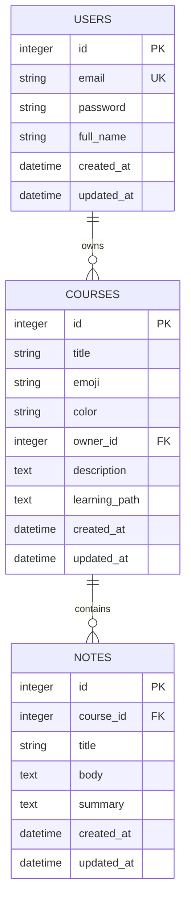
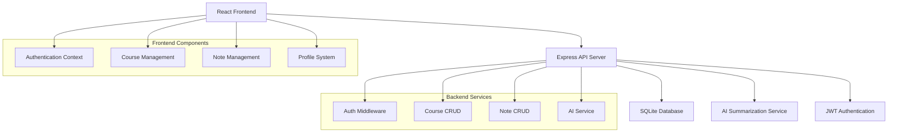

# StudyBuddy - Full-Stack Learning Management System

A comprehensive learning management system built with React frontend and Node.js/Express backend, featuring course creation, note management, and AI-powered summarization.

## 🏗️ **System Architecture**

### **Frontend Architecture**
- **React 18** with modern hooks and functional components
- **React Router** for client-side navigation
- **CSS-in-JS** with modular CSS architecture
- **Axios** for API communication
- **JWT Authentication** with localStorage persistence

### **Backend Architecture**
- **Express.js** RESTful API server
- **SQLite** database with custom ORM
- **JWT-based authentication** with bcrypt password hashing
- **AI Integration** for note summarization
- **CORS** enabled for frontend-backend communication

### **Database Schema Diagram**



### **Agent Flow (Conceptual)**

```text
1. User submits a request.
2. System parses intent and constraints.
3. If more context is needed, it searches and reads code/files.
4. Using the evidence, it drafts a plan or answer.
5. If confidence is low, it loops: narrows the search and re-checks assumptions.
6. When confidence is high, it implements changes or responds.
7. If the user reports errors, it re-enters the self-correction loop.
```

### **API Flow Architecture**



## 🔧 **Technical Implementation Details**

### **Authentication System**
- **JWT Tokens**: Stateless authentication with configurable expiration
- **Password Security**: bcrypt with salt rounds (10)
- **Middleware Pattern**: Custom `authenticateToken` middleware for protected routes
- **Frontend Context**: React Context API for global auth state management

### **Database Design Choices**
- **SQLite**: Chosen for simplicity, portability, and zero-configuration
- **Custom ORM**: Built-in query functions for performance and control
- **JSON Storage**: Learning paths stored as JSON strings for flexibility
- **Cascade Deletes**: Proper foreign key relationships with cascade deletion

### **AI Integration**
- **External API**: Integration with AI service for note summarization
- **Error Handling**: Graceful fallback when AI service is unavailable
- **Async Processing**: Non-blocking AI requests with proper timeout handling

## 📝 **Logic Explanation**

### **Why Express.js with Custom ORM?**
1. **Performance**: Direct SQL queries provide better performance than heavy ORMs
2. **Control**: Full control over SQL optimization and database interactions
3. **Learning**: Understanding of database operations without abstraction layers
4. **Simplicity**: No complex migrations or ORM configurations needed

### **Why JWT Authentication?**
1. **Stateless**: No server-side session storage required
2. **Scalability**: Easy to scale across multiple server instances
3. **Mobile Friendly**: Works seamlessly with mobile applications
4. **Security**: Configurable token expiration and refresh mechanisms

### **Why React with Functional Components?**
1. **Modern Patterns**: Hooks provide cleaner state management
2. **Performance**: Better optimization with React.memo and useCallback
3. **TypeScript Ready**: Easy migration path to TypeScript
4. **Testing**: Simpler unit testing with functional components

### **Why SQLite Database?**
1. **Zero Configuration**: No database server setup required
2. **Portability**: Single file database for easy deployment
3. **Performance**: Excellent for small to medium applications
4. **Reliability**: ACID compliant with full transaction support

## 📚 **Prompt Library**

This section documents the *project-facing* prompts and interaction patterns used to build/operate StudyBuddy tooling. Some internal “system” instructions from the runtime environment are not reproducible here; instead, this captures the reusable prompts you can keep in-repo.

### **System Prompts (Project-Level)**

- **Backend/API coding assistant**
  - Goal: implement endpoints, fix bugs, and update DB logic with minimal, safe changes.
  - Constraints: read code first, prefer small diffs, avoid breaking API contracts.

- **Frontend coding assistant**
  - Goal: implement UI features consuming the API with clear error states.
  - Constraints: keep components modular, avoid introducing unnecessary dependencies.

### **Tool Definitions (What each tool is for)**

- **code_search / grep_search**
  - Locate authoritative logic (route handlers, middleware, DB layer).
- **read_file / list_dir**
  - Confirm current behavior before changing anything.
- **apply_patch / write_to_file**
  - Implement minimal, reviewable changes (small hunks, targeted edits).
- **run_command**
  - Used only when needed to verify behavior (tests, lint, dev server).

### **Few-Shot Examples (Copy/paste prompts)**

```text
Example 1: Add an endpoint
"Add GET /health that returns { ok: true }. Use the same response format as other endpoints. Update Postman collection too."

Example 2: Fix a bug with evidence
"/courses/:id returns 500 sometimes. Find the root cause in the backend, explain it, and patch it. Don’t change unrelated files."

Example 3: Documentation generation
"Scan backend routes and generate a Postman Collection v2.1 JSON using {{baseUrl}} and {{authToken}} variables."
```

### **Why these instructions (temperature / style / safety)**

- **Lower creativity for code edits**
  - Code generation benefits from determinism: fewer “invented” APIs and more faithful edits.
- **Evidence-first workflow**
  - Reading/searching before writing reduces regressions and keeps changes aligned with the repo.
- **Small diffs**
  - Easier to review, less likely to introduce side effects.

## 🧠 **Pattern Choice Explanation**

### **Agent pattern: Plan-and-Execute vs ReAct**

- **Plan-and-Execute** is used for multi-step tasks (e.g., “generate a Postman collection”, “update docs”, “refactor auth”). It keeps work chunked and trackable.
- **ReAct-style loops** (observe → act → re-observe) are used when debugging or when requirements are ambiguous, because it supports quick self-correction based on new evidence.

### **Backend pattern: Express Middleware**

- Authentication/authorization is implemented as **middleware** (e.g., `authenticateToken`) because:
  - It centralizes security checks.
  - It reduces duplicated code across handlers.
  - It makes it easy to apply rules per-route.

## 🚀 **Deployment & Development**

### **Development Setup**
```bash
# Backend
cd backend
npm install
npm run dev

# Frontend  
cd ..
npm install
npm run dev
```

### **Environment Variables**
```env
# Backend (.env)
JWT_SECRET=your-secret-key-change-in-production
PORT=3000

# Frontend (.env)
VITE_API_URL=http://localhost:3000
```

### **Build Process**
- **Frontend**: Vite for fast development and optimized builds
- **Backend**: Standard Node.js with automatic port detection
- **Database**: SQLite with automatic initialization

## 🔐 **Security Features**

- **Password Hashing**: bcrypt with salt rounds
- **JWT Security**: Configurable secret and expiration
- **CORS Protection**: Configured for specific origins
- **Input Validation**: Request body validation and sanitization
- **SQL Injection Prevention**: Parameterized queries only
- **Rate Limiting**: Ready for implementation (middleware structure in place)

## 📊 **Performance Optimizations**

- **Frontend**: React.memo, useCallback, useMemo for re-render optimization
- **Backend**: Connection pooling ready, query optimization
- **Database**: Indexed columns for frequently queried fields
- **API Response**: Proper HTTP status codes and response formatting
- **Asset Loading**: Lazy loading for course notes and images

## 🧪 **Testing Strategy**

- **Unit Tests**: Ready for Jest implementation
- **Integration Tests**: API endpoint testing structure
- **E2E Tests**: Ready for Cypress or Playwright
- **Database Tests**: SQLite in-memory database for testing

## 🔮 **Future Enhancements**

- **Real-time Features**: WebSocket integration for live collaboration
- **File Uploads**: Course material and document management
- **Advanced AI**: More AI features like quiz generation and content recommendations
- **Analytics**: Learning progress tracking and insights
- **Mobile App**: React Native implementation

## 📈 **Scalability Considerations**

- **Database**: Easy migration to PostgreSQL or MySQL
- **Authentication**: Ready for OAuth providers integration
- **File Storage**: Ready for cloud storage integration (AWS S3, CloudFront)
- **Load Balancing**: Stateless design ready for horizontal scaling
- **Caching**: Redis integration ready for session and data caching

## 📁 **Project Structure**

```
studybuddy/
├── 📄 README.md                          # This file - project documentation
├── 📄 package.json                       # Root package.json (frontend deps & scripts)
├── 📄 vite.config.js                     # Vite configuration with proxy setup
├── 📄 StudyBuddy-API-Postman-Collection.json  # Postman collection for API testing
│
├── 📁 scripts/
│   └── 📄 start-dev.cjs                  # Development startup script (handles port conflicts)
│
├── 📁 src/                               # Frontend React source code
│   ├── 📄 App.jsx                        # Main app component with routing
│   ├── 📄 App.css                        # Main app styles
│   ├── 📄 main.jsx                       # React entry point
│   │
│   ├── 📁 components/                    # Reusable React components
│   │   ├── 📄 Auth.jsx                   # Login/Signup forms
│   │   ├── 📄 CourseSection.jsx          # Course listing component
│   │   ├── 📄 CourseDetails.jsx          # Course detail view
│   │   ├── 📄 CreateCourse.jsx           # Course creation form
│   │   ├── 📄 ContactSection.jsx         # Contact/Landing section
│   │   ├── 📄 Footer.jsx                 # App footer
│   │   ├── 📄 Hero.jsx                   # Landing hero section
│   │   ├── 📄 Profile.jsx                # User profile page
│   │   └── 📄 TopNav.jsx                 # Navigation bar
│   │
│   ├── 📁 context/
│   │   └── 📄 AuthContext.jsx            # Authentication context provider
│   │
│   ├── 📁 services/
│   │   └── 📄 api.js                     # API client functions
│   │
│   └── 📁 assets/                        # Static assets (images, icons)
│
└── 📁 backend/                           # Backend Node.js/Express API
    ├── 📄 server.js                      # Main server entry (SQLite version)
    ├── 📄 server-final.js                # Production server (PostgreSQL/Supabase)
    ├── 📄 package.json                   # Backend dependencies
    ├── 📄 database-sqlite.js             # SQLite database setup
    ├── 📄 database.js                    # PostgreSQL database setup
    ├── 📄 postgresql-schema.sql          # PostgreSQL schema
    │
    ├── 📁 config/
    │   └── 📄 index.js                   # Configuration utilities
    │
    ├── 📁 utils/
    │   └── 📄 ai-service.js              # AI summarization service
    │
    └── 📁 uploads/                       # File upload directory (created at runtime)
```

## 📚 **API Endpoints Reference**

### **Authentication Endpoints**

| Method | Endpoint | Description | Auth Required |
|--------|----------|-------------|---------------|
| POST | `/auth/signup` | Register new user | No |
| POST | `/auth/login` | User login | No |
| GET | `/auth/me` | Get current user info | Yes |
| POST | `/auth/logout` | Logout (client-side) | No |
| GET | `/auth/providers` | List OAuth providers | No |

### **Course Endpoints**

| Method | Endpoint | Description | Auth Required |
|--------|----------|-------------|---------------|
| GET | `/courses` | List all courses | No |
| GET | `/courses/:id` | Get course details | No |
| POST | `/courses` | Create new course | Yes |
| PUT | `/courses/:id` | Update course | Yes (Owner) |
| DELETE | `/courses/:id` | Delete course | Yes (Owner) |

### **Enrollment Endpoints**

| Method | Endpoint | Description | Auth Required |
|--------|----------|-------------|---------------|
| POST | `/courses/:id/enroll` | Enroll in course | Yes |
| DELETE | `/courses/:id/enroll` | Unenroll from course | Yes |
| GET | `/courses/:id/enrollments` | List enrollments | Yes (Owner) |

### **Notes Endpoints**

| Method | Endpoint | Description | Auth Required |
|--------|----------|-------------|---------------|
| GET | `/courses/:courseId/notes` | List course notes | Yes (Enrolled/Owner) |
| GET | `/courses/:courseId/notes/:id` | Get note details | Yes (Enrolled/Owner) |
| POST | `/courses/:courseId/notes` | Create note | Yes (Owner) |
| PUT | `/courses/:courseId/notes/:id` | Update note | Yes (Owner) |
| DELETE | `/courses/:courseId/notes/:id` | Delete note | Yes (Owner) |
| POST | `/courses/:courseId/notes/:id/summarize` | AI summarize | Yes (Enrolled/Owner) |

### **User Endpoints**

| Method | Endpoint | Description | Auth Required |
|--------|----------|-------------|---------------|
| GET | `/user/dashboard` | Get user dashboard | Yes |

---

## 🔧 **Troubleshooting Guide**

### **Common Issues & Solutions**

#### 1. Port 3000 Already in Use
**Error:** `EADDRINUSE: address already in use :::3000`

**Solution:**
```bash
# Find the process using port 3000
lsof -nP -iTCP:3000 | grep LISTEN

# Kill the process (replace <PID> with the actual number)
kill -9 <PID>

# Or use the automated script
npm start
```

#### 2. Frontend Can't Connect to Backend
**Error:** API requests failing, CORS errors, or "Network Error"

**Solution:**
- Ensure backend is running on `http://localhost:3000`
- Check `vite.config.js` proxy configuration
- Verify `VITE_API_URL` environment variable

#### 3. Auth Component Not Defined
**Error:** `Uncaught ReferenceError: Auth is not defined`

**Solution:** Ensure `Auth` component is imported in `App.jsx`:
```javascript
import Auth from './components/Auth';
```

#### 4. Database Connection Issues
**Error:** "Failed to open database" or SQLite errors

**Solution:**
- Check write permissions in `backend/` directory
- Ensure `studybuddy.db` file can be created/accessed
- Run database initialization: `npm run init-db`

#### 5. JWT Authentication Failing
**Error:** "Invalid or expired token" or 401 errors

**Solution:**
- Check `JWT_SECRET` is set in backend `.env`
- Clear browser localStorage and re-login
- Verify token format in request headers: `Authorization: Bearer <token>`

---

## 🔐 **Environment Variables Reference**

### **Backend Variables (`backend/.env`)**

| Variable | Default | Required | Description |
|----------|---------|----------|-------------|
| `PORT` | `3000` | No | Server port |
| `BASE_URL` | `http://localhost:3000` | No | Backend base URL |
| `FRONTEND_URL` | `http://localhost:5175` | No | Frontend URL for CORS |
| `JWT_SECRET` | - | **Yes** | Secret key for JWT tokens |
| `DATABASE_URL` | - | For PostgreSQL | PostgreSQL connection string |
| `GOOGLE_AI_API_KEY` | - | For AI | Google AI Studio API key |
| `GOOGLE_CLIENT_ID` | - | For OAuth | Google OAuth client ID |
| `GOOGLE_CLIENT_SECRET` | - | For OAuth | Google OAuth client secret |

### **Frontend Variables (`.env`)**

| Variable | Default | Required | Description |
|----------|---------|----------|-------------|
| `VITE_API_URL` | `http://localhost:3000` | No | Backend API URL |

---

## 🧪 **Testing with Postman**

### **Quick Start**

1. **Import Collection:**
   - Open Postman
   - File → Import → Select `StudyBuddy-API-Postman-Collection.json`

2. **Set Environment Variables:**
   - Create environment with:
     - `baseUrl`: `http://localhost:3000`
     - `authToken`: (leave empty, will be filled after login)

3. **Test Authentication:**
   - Send `POST /auth/signup` to create user
   - Send `POST /auth/login` to get token
   - Copy token from response and set in `authToken` environment variable

4. **Test Protected Endpoints:**
   - All endpoints requiring auth will now use the token automatically

### **Example Request Flow**

```
1. POST /auth/signup → Create account
2. POST /auth/login → Get JWT token
3. POST /courses → Create a course (with token)
4. GET /courses → List courses
5. POST /courses/:id/enroll → Enroll in course
```
