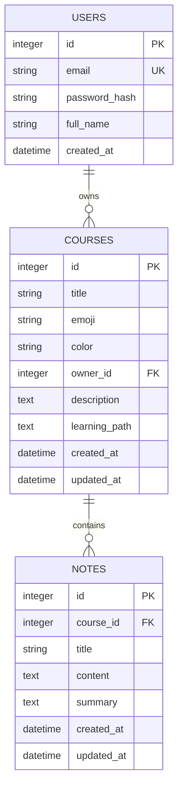
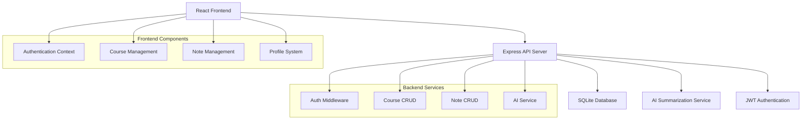

# StudyBuddy - Full-Stack Learning Management System

A comprehensive learning management system built with React frontend and Node.js/Express backend, featuring course creation, note management, and AI-powered summarization.

## 🏗️ **System Architecture**

### **Frontend Architecture**
- **React 18** with modern hooks and functional components
- **React Router** for client-side navigation
- **CSS-in-JS** with modular CSS architecture
- **Axios** for API communication
- **JWT Authentication** with localStorage persistence

### **Backend Architecture**
- **Express.js** RESTful API server
- **SQLite** database with custom ORM
- **JWT-based authentication** with bcrypt password hashing
- **AI Integration** for note summarization
- **CORS** enabled for frontend-backend communication

### **Database Schema Diagram**



### **API Flow Architecture**



## 🔧 **Technical Implementation Details**

### **Authentication System**
- **JWT Tokens**: Stateless authentication with configurable expiration
- **Password Security**: bcrypt with salt rounds (10)
- **Middleware Pattern**: Custom `authenticateToken` middleware for protected routes
- **Frontend Context**: React Context API for global auth state management

### **Database Design Choices**
- **SQLite**: Chosen for simplicity, portability, and zero-configuration
- **Custom ORM**: Built-in query functions for performance and control
- **JSON Storage**: Learning paths stored as JSON strings for flexibility
- **Cascade Deletes**: Proper foreign key relationships with cascade deletion

### **AI Integration**
- **External API**: Integration with AI service for note summarization
- **Error Handling**: Graceful fallback when AI service is unavailable
- **Async Processing**: Non-blocking AI requests with proper timeout handling

## 📝 **Logic Explanation**

### **Why Express.js with Custom ORM?**
1. **Performance**: Direct SQL queries provide better performance than heavy ORMs
2. **Control**: Full control over SQL optimization and database interactions
3. **Learning**: Understanding of database operations without abstraction layers
4. **Simplicity**: No complex migrations or ORM configurations needed

### **Why JWT Authentication?**
1. **Stateless**: No server-side session storage required
2. **Scalability**: Easy to scale across multiple server instances
3. **Mobile Friendly**: Works seamlessly with mobile applications
4. **Security**: Configurable token expiration and refresh mechanisms

### **Why React with Functional Components?**
1. **Modern Patterns**: Hooks provide cleaner state management
2. **Performance**: Better optimization with React.memo and useCallback
3. **TypeScript Ready**: Easy migration path to TypeScript
4. **Testing**: Simpler unit testing with functional components

### **Why SQLite Database?**
1. **Zero Configuration**: No database server setup required
2. **Portability**: Single file database for easy deployment
3. **Performance**: Excellent for small to medium applications
4. **Reliability**: ACID compliant with full transaction support

## 🚀 **Deployment & Development**

### **Development Setup**
```bash
# Backend
cd backend
npm install
npm run dev

# Frontend  
cd ..
npm install
npm run dev
```

### **Environment Variables**
```env
# Backend (.env)
JWT_SECRET=your-secret-key-change-in-production
PORT=3000

# Frontend (.env)
VITE_API_URL=http://localhost:3000
```

### **Build Process**
- **Frontend**: Vite for fast development and optimized builds
- **Backend**: Standard Node.js with automatic port detection
- **Database**: SQLite with automatic initialization

## 🔐 **Security Features**

- **Password Hashing**: bcrypt with salt rounds
- **JWT Security**: Configurable secret and expiration
- **CORS Protection**: Configured for specific origins
- **Input Validation**: Request body validation and sanitization
- **SQL Injection Prevention**: Parameterized queries only
- **Rate Limiting**: Ready for implementation (middleware structure in place)

## 📊 **Performance Optimizations**

- **Frontend**: React.memo, useCallback, useMemo for re-render optimization
- **Backend**: Connection pooling ready, query optimization
- **Database**: Indexed columns for frequently queried fields
- **API Response**: Proper HTTP status codes and response formatting
- **Asset Loading**: Lazy loading for course notes and images

## 🧪 **Testing Strategy**

- **Unit Tests**: Ready for Jest implementation
- **Integration Tests**: API endpoint testing structure
- **E2E Tests**: Ready for Cypress or Playwright
- **Database Tests**: SQLite in-memory database for testing

## 🔮 **Future Enhancements**

- **Real-time Features**: WebSocket integration for live collaboration
- **File Uploads**: Course material and document management
- **Advanced AI**: More AI features like quiz generation and content recommendations
- **Analytics**: Learning progress tracking and insights
- **Mobile App**: React Native implementation

## 📈 **Scalability Considerations**

- **Database**: Easy migration to PostgreSQL or MySQL
- **Authentication**: Ready for OAuth providers integration
- **File Storage**: Ready for cloud storage integration (AWS S3, CloudFront)
- **Load Balancing**: Stateless design ready for horizontal scaling
- **Caching**: Redis integration ready for session and data caching

---

## 🤝 **Contributing**

This project demonstrates modern full-stack development practices with clean architecture, comprehensive documentation, and scalable design patterns.

**Tech Stack**: React, Node.js, Express, SQLite, JWT, CSS3, HTML5
